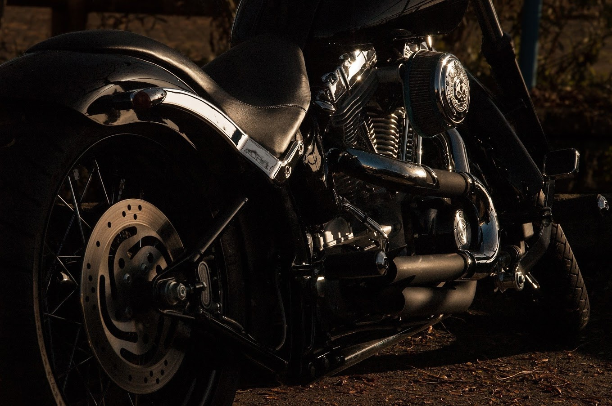

# 🏍️ Basic Motorcycle Website

[](https://github.com/Skorpion02/P-gina_web_b-sica)
[](https://github.com/Skorpion02/P-gina_web_b-sica/blob/main/LICENSE)
[](https://github.com/Skorpion02/P-gina_web_b-sica/commits/main)
[](https://github.com/Skorpion02/P-gina_web_b-sica/issues)

---

> **A clean, responsive, and customizable static website template for motorcycle enthusiasts, clubs, or businesses.**

---

## 📝 Table of Contents

- [Overview](#overview)
- [Demo](#demo)
- [Getting Started](#getting-started)
  - [Prerequisites](#prerequisites)
  - [Installation](#installation)
- [Features](#features)
- [Project Structure](#project-structure)
- [Usage](#usage)
- [Roadmap](#roadmap)
- [Testing](#testing)
- [Built With](#built-with)

---

## 📖 Overview

**Basic Motorcycle Website** is a lightweight and modern web template designed for anyone looking to showcase motorcycles, categories, events, or clubs with style. It features a visually engaging layout, clear navigation, and sections tailored for motorcycle content.

<div align="center">
  
</div>

### Why Use This Template?

- **Intuitive Navigation:** Effortless browsing with a sticky menu and organized sections.
- **Responsive Design:** Looks great on desktop, tablet, and mobile (with `@media` queries).
- **Easy Customization:** Clean HTML5 and CSS3 structure, ready for your content and branding.
- **No Dependencies:** 100% static, no build steps or installs required.
- **Fast Deployment:** Just upload and go!

---

## 🌐 Demo

> **Live preview coming soon.**  
> _For now, clone/download and open `index.html` in your browser!_

---

## 🚀 Getting Started

### Prerequisites

- Web browser (Chrome, Firefox, Edge, Safari, etc.)
- Basic knowledge of HTML/CSS for customization

### Installation

1. **Clone this repository:**
    ```bash
    git clone https://github.com/Skorpion02/P-gina_web_b-sica.git
    ```
2. **Go to the project directory:**
    ```bash
    cd P-gina_web_b-sica
    ```
3. **Open `index.html` in your browser.**  
   No dependencies or server setup required!

---

## ✨ Features

- **Responsive Design:** Adapts to all screen sizes.
- **Sticky Navigation:** Menu stays visible as you scroll.
- **Gallery Sections:** Showcase different motorcycle categories with images and descriptions.
- **Modern Hover Effects:** Interactive image effects for user engagement.
- **Easy Theming:** Change colors and fonts easily in `styles.css`.

---

## 📁 Project Structure

```
.
├── index.html
├── styles/
│   └── styles.css
└── img/
    ├── header.jpg
    ├── carretera.jpg
    ├── cross.jpg
    └── vintage.jpg
```

---

## 💻 Usage

Simply open `index.html` in your preferred web browser.

```bash
# macOS:
open index.html
# Windows:
start index.html
# Linux:
xdg-open index.html
```

---

## 🗺️ Roadmap

- [ ] Improve mobile responsiveness
- [ ] Add a contact form section
- [ ] Integrate a blog/news system
- [ ] Explore theme customization with CSS variables
- [ ] Add JavaScript for interactivity (e.g. sliders, modals)

---

## 🧪 Testing

This project is a static site. Testing is performed by:

- Manually checking layout and features on different browsers/devices
- Ensuring accessibility and responsive behavior

---

## 🛠️ Built With

- HTML5
- CSS3 (with Google Fonts)
- Font Awesome
- JavaScript (optional for future features)

---

## 🤝 Contributing

Pull requests and suggestions are welcome!  
If you have ideas for improvements or spot a bug, please open an issue.

---

## 📄 License

This project is licensed under the [MIT License](LICENSE).

---

<div align="center">
  <b>Made with ❤️ by Skorpion02</b>
</div>
